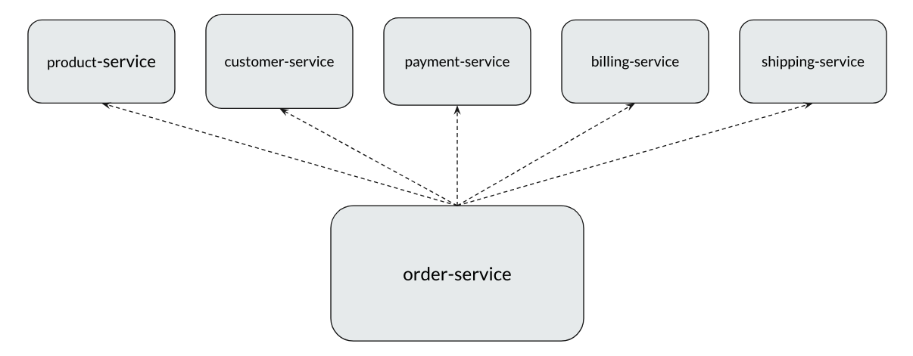
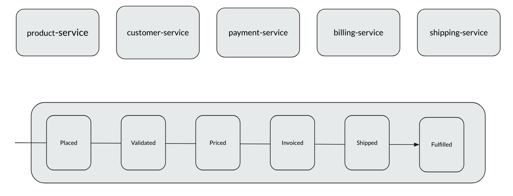
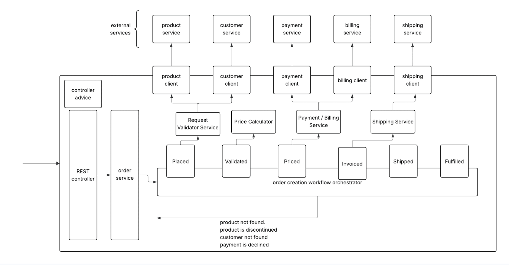
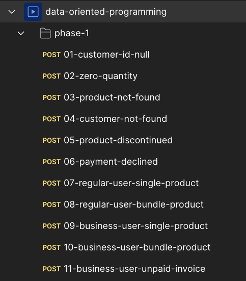

## Order Processing System - Phase 1

We will develop an order processing system which handles the order fulfillment orchestration process. It begins when an order is placed and continues through various stages such as payment processing, invoice generation, shipping and order fulfillment.


### **Why Are We Building This?**

To apply all the modern Java features we have learnt so far in this course including records, sealed types, switch expressions etc, in a real-world style project.

- Structuring your code for readability and scalability
- Designing meaningful domain models
- Writing clean interfaces and implementations
- Applying modern Java language capabilities where they make sense

### **System Overview**

In a typical order processing system, multiple microservices collaborate to complete a single order flow. 

- `customer-service` – manages customer details
- `product-service` – manages product details
- `payment-service` – handles payment processing  
- `billing-service` – generates invoices
- `shipping-service` – coordinates packaging, tracking, and delivery  
- `order-service` – initiates and orchestrates the entire flow  



**In this exercise, we will focus on building only the `order-service`.**  
It will act as the **entry point** and **orchestrator**, interacting with the other services to complete an order.

---

## External Services

To simplify development and let us focus rely on the `order-service`, all other supporting services have been packaged into a single executable JAR `external-services.jar`.
Please refer to the detailed instructions [here](04-external-services.md) to learn how to run the JAR and interact with the external services.

---

## Product-Service

```jsonß
  {
    "type": "Active",
    "product": {
      "productId": "SIN001",
      "name": "Wireless Keyboard",
      "price": 29.99
    },
    "seller": {
      "name": "TechGear Inc.",
      "stock": 200
    }
  }
```
```json  
  {
    "type": "Active",
    "product": {
      "productId": "BUN003",
      "name": "Smart Home Bundle",
      "originalPrice": 69.98,
      "discountedPrice": 59.99,
      "items": [
        {
          "productId": "SIN005",
          "name": "Smart LED Bulb",
          "price": 19.99
        },
        {
          "productId": "SIN004",
          "name": "Bluetooth Speaker",
          "price": 49.99
        }
      ]
    },
    "seller": {
      "name": "BrightHome Tech",
      "stock": 60
    }
  }
```
```json
  {
    "type": "Discontinued",
    "productId": "DIS001",
    "reason": "Outdated model replaced with newer version",
    "discontinuedAt": "2024-01-15",
    "recommendedProducts": [
      "SIN009",
      "SIN010"
    ]
  }
```
- Product status can be either Active or Discontinued
- Only Active products can be purchased. Discontinued products can NOT be purchased. 
- A Product can be of 2 types.
  - `Single` – a standalone product
  - `Bundle` – a combination of multiple single products offered together, usually at a discounted price
- A bundle product includes two or more single products, grouped and sold as a single unit.

---

### Customer-Service

Customers in the system can fall into one of two categories:

#### 1. **Regular Customer**
Represents an individual making purchases for personal use.

```json
{
  "id": "REG001",
  "name": "John Doe",
  "address": {
    "street": "123 Main St",
    "city": "New York",
    "state": "NY",
    "zipCode": "10001"
  }
}
```

#### 2. **Business Account**
Represents a company or organization making purchases for commercial purposes. Business accounts are associated with a `taxId`.

```json
{
  "id": "BUS001",
  "name": "Tech Solutions Inc.",
  "taxId": "US-TAX-10001",
  "address": {
    "street": "500 Innovation Way",
    "city": "San Francisco",
    "state": "CA",
    "zipCode": "94105"
  }
}
```

> The system should handle both types of customers. Orders, billing, and processing rules may vary depending on the customer type.

---

### Payment Service

- Sample Payment processing POST request

```json
{
  "customerId": "REG001",
  "orderId": "3fa85f64-5717-4562-b3fc-2c963f66afa6",
  "amount": 19.99
}
```
- A payment can either be successfully processed or declined for the given customer id.
- A payment can be declined with 402 status if the customer does not have enough balance. Customer account ids REG002, REG003, BUS002, BUS003 are always configued to fail for testing purposes. 

---

### Billing Service

The billing-service is responsible for generating invoices based on the order’s payment status. There are two types of billing requests.
- `PAID` request - when the payment is successful, an invoice will be generated
- `UNPAID` request - it is applicable only for the business accounts.  Invoices are generated even if payment fails (deferred payment terms for businesses). It is NOT applicable for individual customers.

---

### Shipping Service

The shipping-service is responsible for scheduling the shipment of successfully placed orders. 
(In some cases, Shipping can be declined. However it is not in the scope as of now. Lets focus on the success case)

---

## Order Service Implementation

The `order-service` is the **core service** responsible for orchestrating the order fulfillment process.

### 1. **Receive Request**

**Endpoint:**  
`POST /orders`

**Sample Request Body:**
```json
{
  "customerId": "REG001",
  "productId": "SIN001",
  "quantity": 1
}
```

### 2. **Order Workflow: Step-by-Step Status Transitions**



---

#### **Placed**
- ✅ Fetch product info and customer info.
- ❌ If product is **not found** or **discontinued** → respond with `400 Bad Request`.
- ❌ If customer is **not found** → respond with `400 Bad Request`.
- ✅ If all validations pass → set status to `Validated`.

---

#### **Validated**
- Compute **price summary**:
  - Base price × quantity
  - Discount (for bundles)
  - Tax (based on customer’s state):
  
    | State Code | Tax Rate |
    |------------|----------|
    | MI         | 6%       |
    | WA         | 9%       |
    | FL         | 7%       |
    | TX, NY, CA, IL, AZ | 8% |
    | Others     | 5%       |

- Once price is computed → set status to `Priced`.

---

#### **Priced**
- Call the **Payment Service**:
  - If **payment succeeds** → proceed to billing.
  - If **payment fails**:
    - For regular (individual) customers → stop.
    - For business accounts → continue.
- Generate invoice → set status to `Invoiced`.

---

#### **Invoiced**
- Schedule shipping through the **Shipping Service**.
- On successful scheduling → set status to `Shipped`.

---

#### **Shipped**
- Order has been shipped → final status: `Fulfilled`.

## Implementation Details



## Order Response
Finally we would send an order response which looks like this. 

```json
{
    "orderId": "....",
    "status": "Completed",
    "products": [
        {
            "id": "SIN001",
            "name": "Wireless Keyboard",
            "unitPrice": 29.99,
            "quantity": 1
        }
    ],
    "invoice": {
        "invoiceId": "INV-1EFQ1EX0Z3",
        "paymentStatus": "Paid",
        "priceSummary": {
            "subTotal": 29.99,
            "discountApplied": 0.0,
            "taxAmount": 2.39,
            "finalAmount": 32.38
        },
        "paymentDue": "..." // applicable for Unpaid
    },
    "shipments": [
        {
            "shipmentId": "SHIP-84998505",
            "productId": "SIN001",
            "quantity": 1,
            "shippingAddress": "John Doe, 123 Main St, New York, NY 10001",
            "trackingDetails": {
                "carrier": "UPS",
                "trackingNumber": "1TNXB8CI9889WNBKLK",
                "estimatedDeliveryDate": "2025-04-30"
            }
        }
    ]
}
```
---

## Final Demo

Please ensure that
- The external-service is up and running.
- You have included all the `application.properties`.
```properties
product.service.url=http://localhost:7070/products
customer.service.url=http://localhost:7070/customers
payment.service.url=http://localhost:7070/payment
billing.service.url=http://localhost:7070/billing
shipping.service.url=http://localhost:7070/shipping
```
- Your application starts fine w/o any issues.
    - iIn case of issues, do not panic. Just compare your project with mine.

### Test Cases

Download this [zip file](downloads/postman-tests.zip), unzip, and import the json into your Postman

