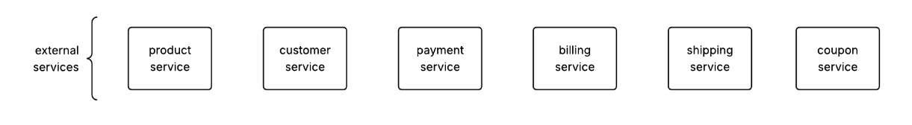
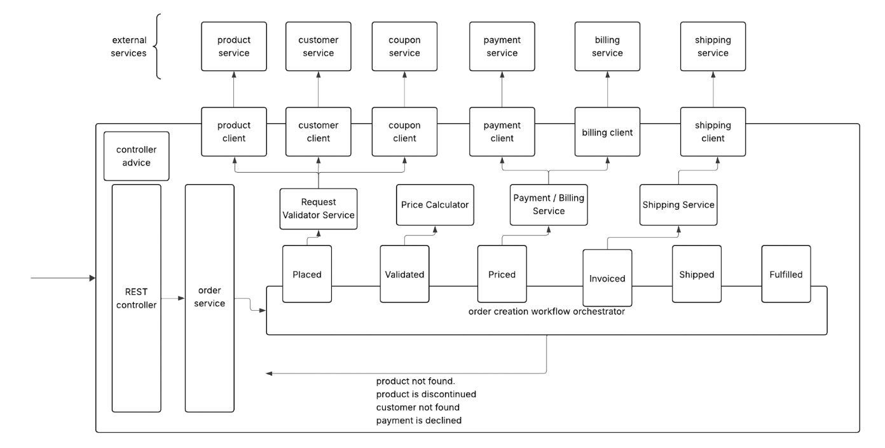
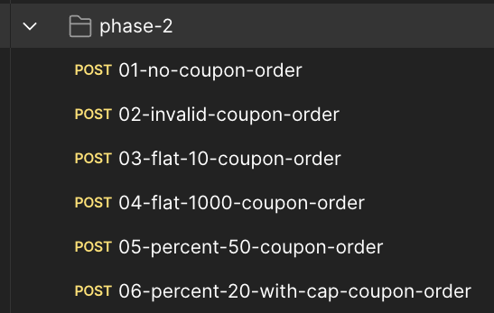

## Order Processing System – Phase 2: Coupon Integration

In **Phase 2**, we enhance the `order-service` with support for **coupon codes**, a standard feature in most e-commerce platforms.

### Goals

- Allow customers to apply a coupon when placing an order  
- Validate and apply eligible discounts during price calculation  
- Reflect the discounted amount clearly in the **invoice**

---

### Coupon Types

- **Flat** – A fixed discount amount (e.g., $10 off.)  
- **Percentage** – A percentage-based discount, with an optional maximum cap (e.g., 20% off up to $50)

| Coupon Type              | Original Price | Discount Applied | Amount Payable |
|--------------------------|----------------|------------------|----------------|
| $10 OFF                  | $300           | $10              | $290           |
| $100 OFF                 | $90            | $85              | $5 (min)       |
| 20% OFF                  | $300           | $60              | $240           |
| 20% OFF up to $50 max    | $300           | $50              | $250           |

Note: 
- There will be a min charge for $5
- Coupons are applied at the order level. Not at the quantity level.
- Coupons are applied **before tax**

---

### Order API – Coupon Support

Our external services include a new service `coupon-service`



The order request can now include an optional `couponCode`.

```json
{
  "customerId": "REG001",
  "productId": "SIN001",
  "quantity": 1,
  "couponCode": "..." // nullable field
}
```

- If a coupon code is provided, the system communicates with the `coupon-service` to validate it
- If the coupon is valid, the corresponding discount is applied
- If the coupon is invalid or unknown, the order proceeds without the discount.
  - This is *NOT* treated as a Bad Request. This behavior is intentional, as coupon codes are often included in URLs. When a user clicks a link with an expired or invalid coupon, we do not show an error. We just proceed with the order without applying the coupon.

---

### Implementation Details



---

## Final Demo

Please ensure that
- The external-service is up and running.
- You have included all the `application.properties`.
```properties
product.service.url=http://localhost:7070/products
customer.service.url=http://localhost:7070/customers
payment.service.url=http://localhost:7070/payment
billing.service.url=http://localhost:7070/billing
shipping.service.url=http://localhost:7070/shipping
coupon.service.url=http://localhost:7070/coupons
```
- Your application starts fine w/o any issues.
    - iIn case of issues, do not panic. Just compare your project with mine.

### Test Cases
All the tests have been shared already. 

