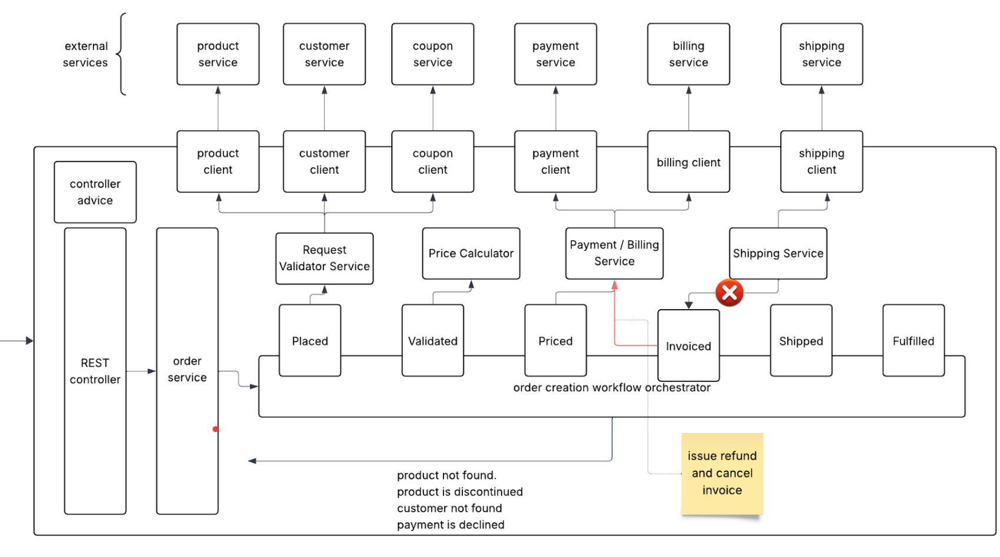
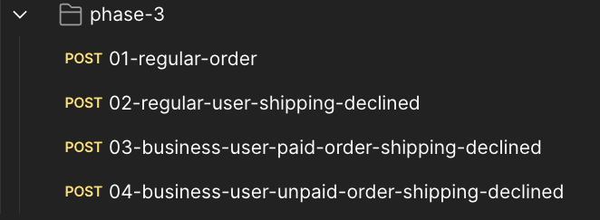

## Order Processing System – Phase 3: Handling Shipping Declines

In **Phase 3**, we need to update the `order-service` to handle shipping declines.  
A shipping decline can occur when an order cannot be shipped due to reasons such as inventory shortages, invalid addresses, or logistics failures.

When a shipping decline happens, the `shipping-service` will respond with an HTTP status code of **422 Unprocessable Entity**.

When a shipping decline is detected during the order workflow:

1. **Refund Paid Orders**  
   - If the customer has already made a payment for the order, the `order-service` must call the `payment-service` to issue a refund.

2. **Cancel the Invoice**  
   - The invoice associated with the order must be canceled to ensure accurate financial reporting.

3. **Return HTTP 422**  
   - Since the order cannot be fulfilled, the `order-service` should return a **422 Unprocessable Entity** response to the caller.

Note:
To simulate shipping decline, product id `SIN010` can be used. The `shipping-service` is hardcoded to decline the request when it receives the product id `SIN010`.

---

### Implementation Details

---

## Final Demo

Please ensure that
- The external-service is up and running.
- Your application starts fine w/o any issues.
    - iIn case of issues, do not panic. Just compare your project with mine.

### Test Cases
All the tests have been shared already. 

