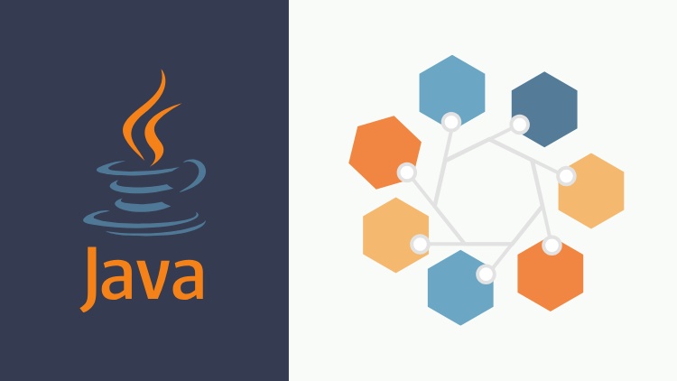

# Data Oriented Programming

This repository contains the code samples, assignments etc for my course.

**Master Data Oriented Programming in Modern Java**
*Build Real-World Applications with Records, Sealed Types, and Pattern Matching*

**What You’ll Learn**

**Modern Java Crash Courses**

* **Records** – Model data with less code, enforce immutability, and make better design choices
* **Sealed Types** – Build safe and expressive type hierarchies with precise control
* **Pattern Matching** – Write cleaner, more concise conditionals with modern switch expressions

**Foundations of Data-Oriented Programming**

* Understand the principles of DOP and how it differs from traditional OOP
* Learn how to design with **Algebraic Data Types (ADTs)** using Records and Sealed Types
* Embrace data-first thinking while staying fully in the Java ecosystem

**Real-World Applications & Use Cases**

* Implement DOP in API modeling, business rules, and domain logic
* Serialize polymorphic sealed hierarchies with Jackson (yes, it's possible!)
* Model state machines and error flows with precision and clarity

**Better Error Handling**

* Represent all possible error cases with sealed hierarchies
* Use pattern matching to handle each case explicitly — no more missed edge cases

**Final Project**
Bring it all together in a hands-on capstone project that mirrors real-world design challenges.

---

**Why Take This Course?**

If you're a Java developer who wants to:
- Write more expressive and readable code
- Replace verbose boilerplate with clean data models
- Think in terms of data, not behavior
- Learn practical functional programming ideas in pure Java

…then this course is for you.

Whether you are building APIs, backends, or complex systems — this course will **change the way you think about and work with data in Java**.
